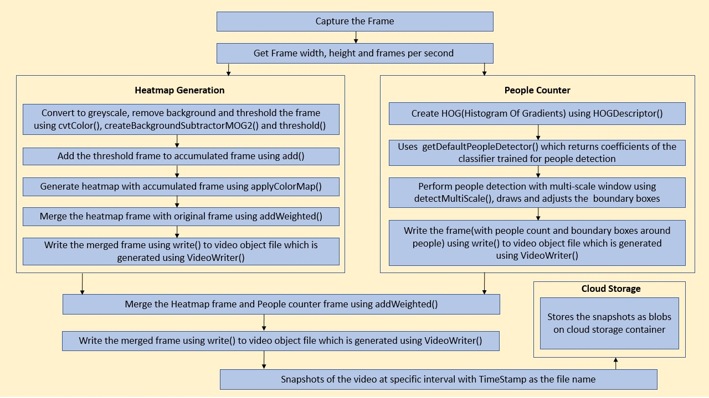
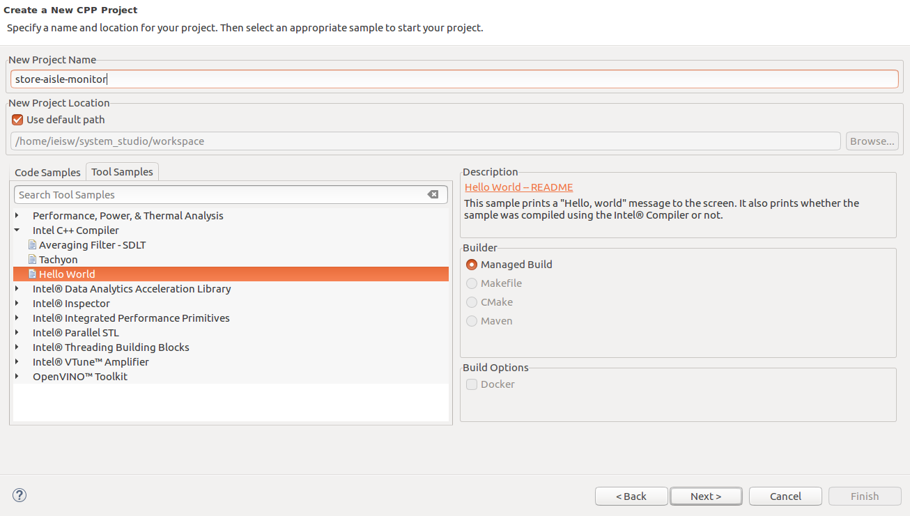
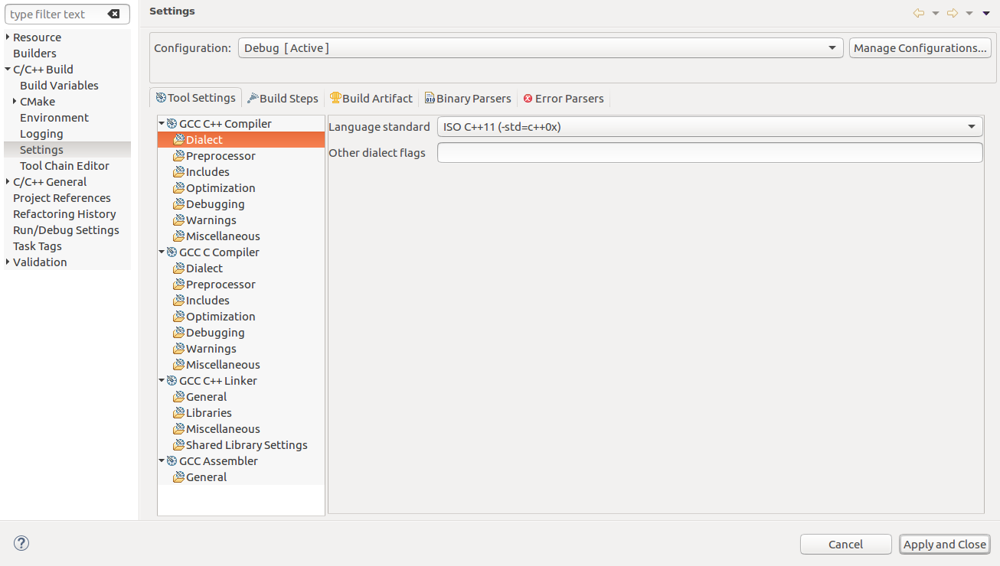
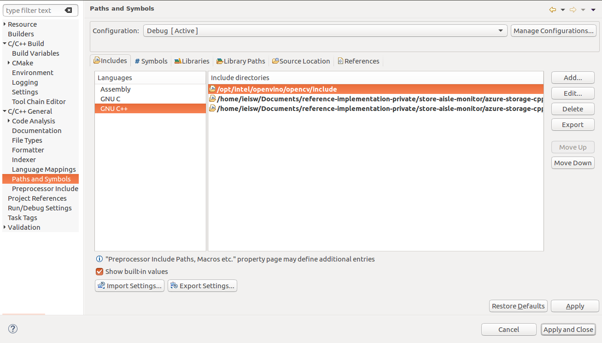
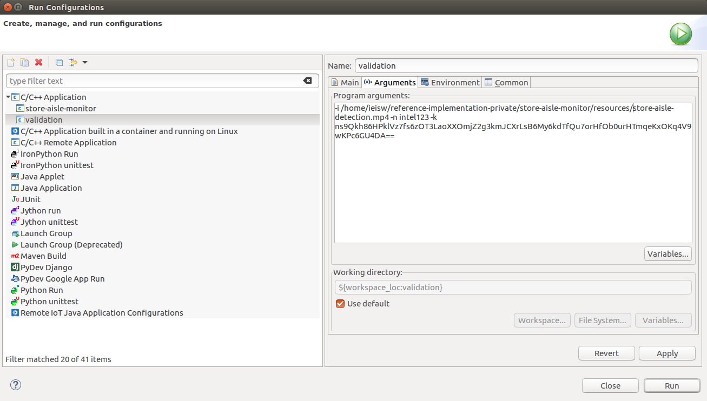

# Store Aisle Monitor

| Details               |                  |
|-----------------------|------------------|
| Target OS             |  Ubuntu\* 16.04 LTS     |
| Programming Language  |  C++ |
| Time to complete      |  45 min      |


This reference implementation is also [available in Python](https://github.com/intel-iot-devkit/reference-implementation-private/blob/master/store-aisle-monitor-python/README.md)


## What it Does

This reference implementation counts the number of people present in an image and generates a motion heatmap. It takes the input from the camera, or a video file for processing. Snapshots of the output are taken at regular intervals and are uploaded to the cloud. It also stores the snapshots of the output locally.

## How it Works
- The application uses a video source, such as a camera or a video file, to grab the frames. The [OpenCV functions](https://docs.opencv.org/3.4/dd/d43/tutorial_py_video_display.html) are used to calculate frame width, frame height and frames per second (fps) of the video source. The application counts the number of people and generates motion heatmap.

    

-  People counter: The OpenCV **HOG Descriptor** detects the people in the frame and bounding boxes are drawn on the people detected.

- Motion Heatmap generation: An accumulated frame is used, on which every frame is added after preprocessing. This accumulated frame is used to generate the motion heatmap using [applyColorMap](https://docs.opencv.org/3.4/d3/d50/group__imgproc__colormap.html#gadf478a5e5ff49d8aa24e726ea6f65d15). The original frame and heatmap frame are merged using [addWeighted](https://docs.opencv.org/3.0-beta/doc/py_tutorials/py_core/py_image_arithmetics/py_image_arithmetics.html), to visualize the movement patterns over time.

-  The heatmap frame and people counter frame are merged using [addWeighted](https://docs.opencv.org/3.0-beta/doc/py_tutorials/py_core/py_image_arithmetics/py_image_arithmetics.html) and this merged frame is saved locally at regular intervals. The output is present in the *output_snapshots* directory of the project directory.

    

-  The application also uploads the results to the Microsoft Azure cloud at regular intervals, if a Microsoft Azure storage name and key are provided. 
    


## Requirements
### Hardware
* 6th to 8th generation Intel® Core™ processors with Iris® Pro graphics or Intel® HD Graphics.

### Software
* [Ubuntu* 16.04](http://releases.ubuntu.com/16.04/)
* Intel® System Studio 2019
* Intel® Distribution of OpenVINO™ toolkit 2019 R1 Release

### Install Intel® Distribution of OpenVINO™ toolkit

Refer to https://software.intel.com/en-us/articles/OpenVINO-Install-Linux for more information on how to install and setup the Intel® Distribution of OpenVINO™ toolkit.


## Install Intel® System Studio 2019

1. Download [Intel® System Studio 2019](https://software.intel.com/en-us/system-studio/choose-download) and extract the downloaded zip file.
2. Open a new terminal and navigate to the directory where the contents are extracted in the previous step.
3. Run ./install.sh script and follow the instructions provided there to install Intel® System Studio 2019.

### Install Azure Storage Client Library for C++

Go to store-aisle-monitor directory

```
cd <path_to_store-aisle-monitor_directory>
```

The Azure Storage Client Library for C++ depends on Casablanca. Install the Casablanca by following the below steps:
```
sudo apt-get install libcpprest-dev
sudo apt-get install g++ git libboost-atomic-dev libboost-thread-dev libboost-system-dev libboost-date-time-dev libboost-regex-dev libboost-filesystem-dev libboost-random-dev libboost-chrono-dev libboost-serialization-dev libwebsocketpp-dev openssl libssl-dev ninja-build
git clone https://github.com/Microsoft/cpprestsdk.git casablanca
cd casablanca
git checkout 43773b9858f0672a4d5856a48f79d97193b295d9
mkdir build.debug
cd build.debug
cmake -G Ninja .. -DCMAKE_BUILD_TYPE=Debug
ninja
cd Release/Binaries
./test_runner *_test.so
cd ../..
sudo ninja install
```

In store-aisle-monitor directory, install the azure-storage-cpp using the following commands:

```
sudo apt-get install gcc-4.8
sudo ln -s /usr/bin/g++ /usr/bin/g++-4.8
sudo apt-get install libboost-all-dev
git clone https://github.com/Azure/azure-storage-cpp.git
sudo apt-get install libxml2-dev uuid-dev
cd azure-storage-cpp/Microsoft.WindowsAzure.Storage
mkdir build.release
cd build.release
CASABLANCA_DIR=../../../casablanca/ CXX=g++-4.8 cmake .. -DCMAKE_BUILD_TYPE=Release
make
```

The library is generated under azure-storage-cpp/Microsoft.WindowsAzure.Storage/build.release/Binaries/.

### Sample Video

Download the sample video in `store-aisle-monitor` directory by running following commands:


```
mkdir resources
cd resources
wget https://github.com/intel-iot-devkit/sample-videos/raw/master/store-aisle-detection.mp4
cd ..
```


### Run the Application on Intel® System Studio 2019

On the system, open Intel® System Studio 2019 and choose your workspace.
1. Click **File -&gt; New -&gt; Project -&gt; Intel Application Development**.
2. Select **C++ project**. Click **Next**.

    

3. Select **Tool Samples** tab and click on  **Intel® C++ Compiler -&gt; Hello World** example and change the name of the project to **store-aisle-monitor**. Click **Next**.

    

4. Select Complier for the project as **GNU Compiler Collection* (GCC)**. Click **Finish**.

    

5. Delete the file named **hello_world.cpp** (example code) from the Project Explorer.
6. Click **File -&gt; New -&gt; File**. Select the parent folder and name the new file as **store-aisle-monitor.cpp**. Click **Finish**.
7. Copy the code from **main.cpp** of this repository to the newly created file.


### Add Libraries
1. Select **Project -&gt; Properties -&gt; C/C++ Build -&gt; Settings -&gt; GCC C++ Linker -&gt; Libraries.**
2. Click on **+** symbol under **Library Search Path (-L)** then click on **File system...** and add **opt/intel/openvino/opencv/lib**.
3. Similarly add **< path_to_azure-storage-cpp >/Microsoft.WindowsAzure.Storage/build.release/Binaries** and **< path_to_casablanca >/build.debug/Release/Binaries**.
4. Click on **+** symbol under **Libraries (-l)** and add **opencv_core** and click on ok.
5. Similarly add the following libraries **opencv_flann, opencv_features2d, opencv_calib3d, opencv_imgproc, opencv_highgui, opencv_objdetect, opencv_videoio, opencv_imgcodecs, opencv_video, crypto, ssl, boost_system, azurestorage, cpprest**
6. Click **Apply and Close**.

    

7. Select **Project -&gt; Properties -&gt; C/C++ Build -&gt; Settings -&gt; GCC C++ Compiler -&gt; Dialect**. Select the Language standard as ISO **C++ 11(-std=c++0x)** and click **Apply and Close**.

    

### Add Include Path
1. Select **Project -> Properties -> C/C++ General -> Paths and Symbols**.
2. Select **Includes -> GNU C++** and Click on **Add...**
3. Click on **File system...** and add **opt/intel/openvino/opencv/include** to include the path of OpenVINO™ toolkit.
4. Similarly add **<path_to_azure-storage-cpp>/Microsoft.WindowsAzure.Storage/includes** and **< path_to_azure-storage-cpp >/Microsoft.WindowsAzure.Storage/samples/SamplesCommon**. Click **Apply and Close**.

    


### Build the project
1. Select **Project -&gt; Build Project**.

    


### Run the Application

1. Select **Run -&gt; Run Configuration.. -&gt; C/C++ Application -&gt;**. Choose the project **store-aisle-monitor**.
2. Click on Arguments and specify the path of the video under Program Arguments followed by `-i`. To upload the results to the cloud, the Microsoft Azure storage name and storage key are provided as the arguments. Use -n and -k options to specify Microsoft Azure storage name and storage key respectively.

    


**Note:** For camera input use `-i cam` under program arguments.  


3. Click **Run**.
4. As per the duration specified in the code, the images are uploaded to the cloud.

    

### Troubleshooting

1. If the following error occurs while running the code on Intel® System Studio: <br>
`error while loading shared libraries: libopencv_core.so.4.0: cannot open shared object file: No such file or directory`.

   Execute these steps:
   * Create a file `opencv.conf` in `/etc/ld.so.conf.d/`.
   * Write the path of the particular library in the opencv.conf file.
   * Run `sudo ldconfig -v`.

2. If the following error occurs while loading azure-storage shared libraries: <br>
`libazurestorage.so: cannot open shared object file: No such file or directory`.

   Execute these steps:

   * Create a file `azurestorage.conf` in `/etc/ld.so.conf.d/`.
   * Write the path of the particular library in the azurestorage.conf file.
   * Run `sudo ldconfig -v`.

## To run the application from the terminal


Updates to several environment variables are required to compile and run OpenVINO™ toolkit applications. Run the following script on the terminal to temporarily set the environment variables.
```
source /opt/intel/openvino/bin/setupvars.sh 
```

Create a directory `build` in store-aisle-monitor directory.


```
mkdir build 
```

Build the project.
```
cd build
cmake .. 
make 
```

Run the application:

```
./store-aisle-monitor -i ../resources/store-aisle-detection.mp4
```

**Note**: To get the input stream from the camera, use the following command:

```
./store-aisle-monitor -i cam
```

### (Optional) Saving snapshots to the Cloud

To upload the results to the cloud, the Microsoft Azure storage name and storage key are provided as the command line arguments. Use -n and -k options to specify Microsoft Azure storage name and storage key respectively.
```
./store-aisle-monitor -i ../resources/store-aisle-detection.mp4 -n <account_name> -k <account-key>
```
**Note:**<br>
* To obtain account name and account key from the Microsoft Azure portal, please refer: https://docs.microsoft.com/en-us/azure/storage/blobs/storage-quickstart-blobs-python#copy-your-credentials-from-the-azure-portal

* To view the uploaded snapshots on cloud, please refer: https://docs.microsoft.com/en-us/azure/storage/blobs/storage-upload-process-images?tabs=net#verify-the-image-is-shown-in-the-storage-account
