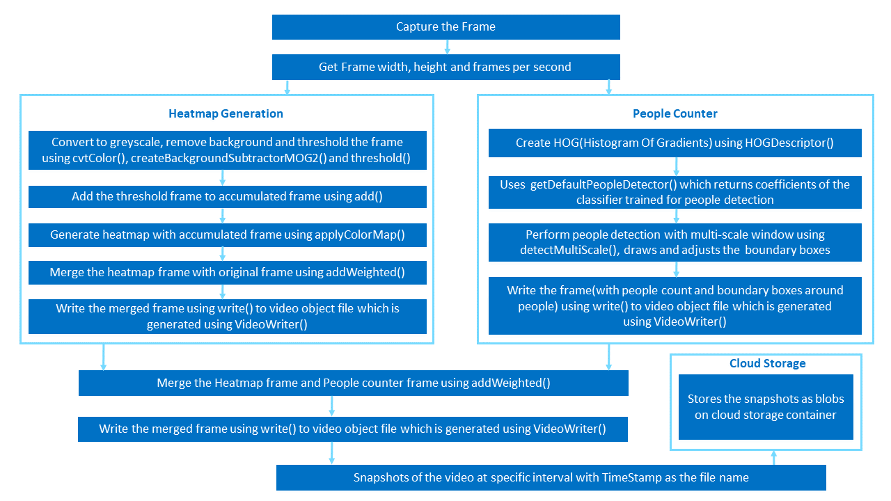
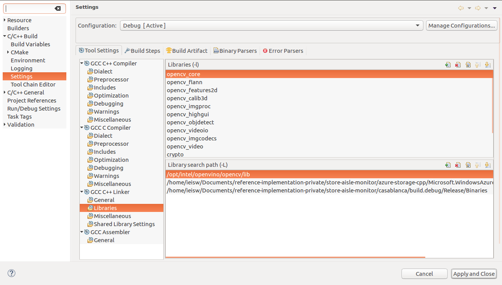
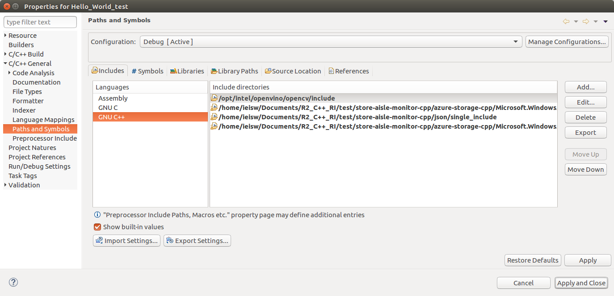
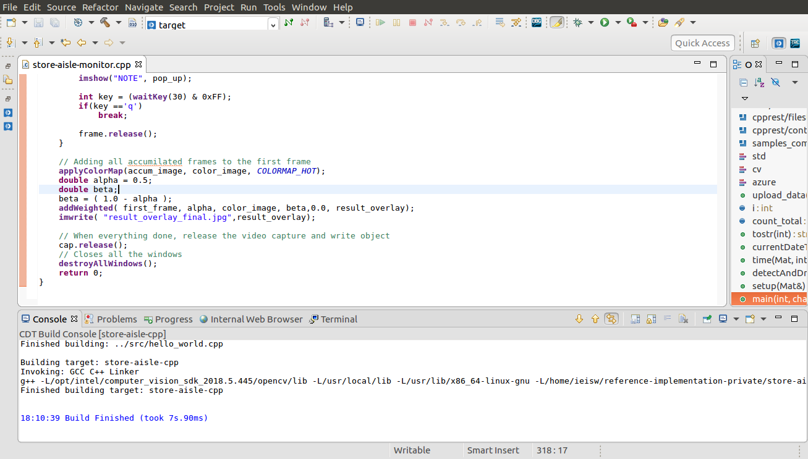
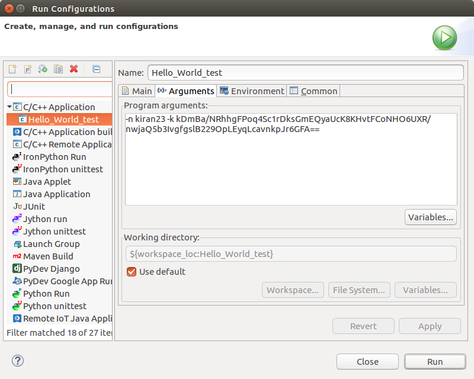

# Store Aisle Monitor

| Details               |                  |
|-----------------------|------------------|
| Target OS             |  Ubuntu\* 18.04 LTS     |
| Programming Language  |  C++ |
| Time to complete      |  45 min      |


## What it Does

This reference implementation counts the number of people present in an image and generates a motion heatmap. It takes the input from the camera, or a video file for processing. Snapshots of the output are taken at regular intervals and are uploaded to the cloud. It also stores the snapshots of the output locally.

## Requirements

### Hardware

- 6th to 8th Generation Intel® Core™ processors with Iris® Pro graphics or Intel® HD Graphics

### Software

- [Ubuntu\* 18.04 LTS](http://releases.ubuntu.com/18.04/)<br>
  **Note**: We recommend using a 4.14+ Linux* kernel with this software. Run the following command to determine the kernel version:<br>
     ```
     uname -a
     ```

- Intel® Distribution of OpenVINO™ toolkit 2020 R3 Release

## How it Works
- The application uses a video source, such as a camera or a video file, to grab the frames. The [OpenCV functions](https://docs.opencv.org/3.0-beta/modules/videoio/doc/reading_and_writing_video.html) are used to calculate frame width, frame height and frames per second (fps) of the video source. The application counts the number of people and generates motion heatmap.

    

-  People counter: The OpenCV **HOG Descriptor** detects the people in the frame and bounding boxes are drawn on the people detected.

- Motion Heatmap generation: An accumulated frame is used, on which every frame is added after preprocessing. This accumulated frame is used to generate the motion heatmap using [applyColorMap](https://docs.opencv.org/3.4/d3/d50/group__imgproc__colormap.html#gadf478a5e5ff49d8aa24e726ea6f65d15). The original frame and heatmap frame are merged using [addWeighted](https://docs.opencv.org/2.4/doc/tutorials/core/adding_images/adding_images.html), to visualize the movement patterns over time.

-  The heatmap frame and people counter frame are merged using [addWeighted](https://docs.opencv.org/2.4/doc/tutorials/core/adding_images/adding_images.html) and this merged frame is saved locally at regular intervals. The output is present in the *build* directory of the project directory.

-  The application also uploads the results to the Microsoft Azure cloud at regular intervals, if a Microsoft Azure storage name and key are provided. 
    

## Setup
### Get the code
Clone the reference implementation<br>
```
sudo apt-get update && sudo apt-get install git
git clone https://github.com/intel-iot-devkit/store-aisle-monitor-cpp.git
```

### Install OpenVINO

Refer to [Install Intel® Distribution of OpenVINO™ toolkit for Linux*](https://software.intel.com/en-us/articles/OpenVINO-Install-Linux) to learn how to install and configure the toolkit.

### Install Intel® System Studio 2019

1. Download [Intel® System Studio 2019](https://software.intel.com/en-us/system-studio/choose-download) and extract the downloaded zip file.
2. Open a new terminal and navigate to the directory where the contents are extracted in the previous step.
3. Run ./install.sh script and follow the instructions provided there to install Intel® System Studio 2019.

### Other dependencies

**Azure Storage Client Library**<br>

The [Azure Storage Client Library for C++](https://github.com/Azure/azure-storage-cpp) allows you to build applications against Microsoft Azure Storage. [Azure Storage](https://docs.microsoft.com/en-us/azure/storage/common/storage-introduction) is Microsoft's cloud storage solution for modern data storage scenarios. Azure Storage offers a massively scalable object store for data objects, a file system service for the cloud, a messaging store for reliable messaging, and a NoSQL store.

### Install the dependencies
To download the sample video and install the dependencies of the application, run the below command in the `store-aisle-monitor-cpp` directory:
```
./setup.sh
```
### The config file
The _resources/config.json_ contains the path of video that will be used by the application as input.

For example:
   ```
   {
       "inputs": [
          {
              "video":"path_to_video/video1.mp4"
          }
       ]
   }
   ```

The `path/to/video` is the path to an input video file.

### Which Input Video to use

We recommend using [store-aisle-detection](https://github.com/intel-iot-devkit/sample-videos/blob/master/store-aisle-detection.mp4) video.
For example:
   ```
   {
       "inputs": [
          {
              "video":"sample-videos/store-aisle-detection.mp4
          }
       ]
   }
   ```
If the user wants to use any other video, it can be used by providing the path in the config.json file.

### Using the Camera instead of video
Replace `path/to/video` with the camera ID in the **config.json** file, where the ID is taken from the video device (the number **X** in /dev/video**X**).

On Ubuntu, to list all available video devices use the following command:

```
ls /dev/video*
```

For example, if the output of above command is __/dev/video0__, then config.json would be:

```
  {
     "inputs": [
        {
           "video":"0"
        }
     ]
  }
```
### Setup the environment

Configure the environment to use the Intel® Distribution of OpenVINO™ toolkit one time per session by exporting environment variables:

```
source /opt/intel/openvino/bin/setupvars.sh
```
**Note:** This command needs to be executed only once in the terminal where the application will be executed. If the terminal is closed, the command needs to be executed again.

### Build the application
To build, go to intruder-detector-cpp directory and run the following commands:

```
mkdir -p build && cd build
cmake ..
make
```

## Run the application
### Run the Application from the Terminal

To run the application, use the following command:
```
./store-aisle-monitor 
```

### (Optional) Saving snapshots to the Cloud

To upload the results to the cloud, the Microsoft Azure storage name and storage key are provided as the command line arguments. Use -n and -k options to specify Microsoft Azure storage name and storage key respectively.
```
./store-aisle-monitor -n <account_name> -k <account-key>
```
**Note:**<br>
* To obtain account name and account key from the Microsoft Azure portal, please refer: https://docs.microsoft.com/en-us/azure/storage/blobs/storage-quickstart-blobs-python#copy-your-credentials-from-the-azure-portal

* To view the uploaded snapshots on cloud, please refer: https://docs.microsoft.com/en-us/azure/storage/blobs/storage-upload-process-images?tabs=net#verify-the-image-is-shown-in-the-storage-account

### Run the Application on Intel® System Studio 2019

On the system, open Intel® System Studio 2019 and choose your workspace.
1. Click **File -&gt; New -&gt; Project -&gt; Intel Application Development**.
2. Select **C++ project**. Click **Next**.

    

3. Select **Tool Samples** tab and click on  **Intel® C++ Compiler -&gt; Hello World** example and change the name of the project to **store-aisle-monitor**. Click **Next**.

    

4. Select Complier for the project as **GNU Compiler Collection* (GCC)**. Click **Finish**.

    

5. Delete the file named **hello_world.cpp** (example code) from the Project Explorer.
6. Click **File -&gt; New -&gt; File**. Select the parent folder and name the new file as **store-aisle-monitor.cpp**. Click **Finish**.
7. Copy the code from **main.cpp** located in **application/src** to the newly created file.
8. Copy the **config.json** from the **<path-to-store-aisle-monitor-cpp>/resources** to the **<current-workspace>/resources** directory.
9. Open the **config.json** in the current-workspace directory and provide the path of the video.


### Add Libraries
1. Select **Project -&gt; Properties -&gt; C/C++ Build -&gt; Settings -&gt; GCC C++ Linker -&gt; Libraries.**
2. Click on **+** symbol under **Library Search Path (-L)** then click on **File system...** and add **opt/intel/openvino/opencv/lib**.
3. Similarly add **< path_to_azure-storage-cpp >/Microsoft.WindowsAzure.Storage/build.release/Binaries** and **< path_to_casablanca >/build.debug/Release/Binaries**.
4. Click on **+** symbol under **Libraries (-l)** and add **opencv_core** and click on ok.
5. Similarly add the following libraries **opencv_flann, opencv_features2d, opencv_calib3d, opencv_imgproc, opencv_highgui, opencv_objdetect, opencv_videoio, opencv_imgcodecs, opencv_video, crypto, ssl, boost_system, azurestorage, cpprest**
6. Click **Apply and Close**.

    

7. Select **Project -&gt; Properties -&gt; C/C++ Build -&gt; Settings -&gt; GCC C++ Compiler -&gt; Dialect**. Select the Language standard as ISO **C++ 11(-std=c++0x)** and click **Apply and Close**.

    

### Add Include Path
1. Select **Project -> Properties -> C/C++ General -> Paths and Symbols**.
2. Select **Includes -> GNU C++** and Click on **Add...**
3. Click on **File system...** and add **opt/intel/openvino/opencv/include** to include the path of OpenVINO™ toolkit.
4. Similarly add **<path_to_azure-storage-cpp>/Microsoft.WindowsAzure.Storage/includes** and **< path_to_azure-storage-cpp >/Microsoft.WindowsAzure.Storage/samples/SamplesCommon**. Click **Apply and Close**.

    

5. Click on **File system...** and add *<path_to_store-aisle-monitor_directory>/application/src*, *<path_to_store-aisle-monitor_directory>/json/single_include* and *<path_to_store-aisle-monitor_directory>/application/include* . Click **Apply and Close**.

### Build the Project
1. Select **Project -&gt; Build Project**.

    


### Run the Project

1. Select **Run -&gt; Run Configuration.. -&gt; C/C++ Application -&gt;**. Choose the project **store-aisle-monitor**.
2. To upload the results to the cloud, the Microsoft Azure storage name and storage key are provided as the arguments. Click on **Arguments** to use -n and -k options to specify Microsoft Azure storage name and storage key respectively.

    

3. Click **Run**.
4. As per the duration specified in the code, the images are uploaded to the cloud.

    

### Troubleshooting

1. If the following error occurs while running the code on Intel® System Studio: <br>
`error while loading shared libraries: libopencv_core.so.4.0: cannot open shared object file: No such file or directory`.

   Execute these steps:
   * Create a file `opencv.conf` in `/etc/ld.so.conf.d/`.
   * Write the path of the particular library in the opencv.conf file.
   * Run `sudo ldconfig -v`.

2. If the following error occurs while loading azure-storage shared libraries: <br>
`libazurestorage.so: cannot open shared object file: No such file or directory`.

   Execute these steps:

   * Create a file `azurestorage.conf` in `/etc/ld.so.conf.d/`.
   * Write the path of the particular library in the azurestorage.conf file.
   * Run `sudo ldconfig -v`.
